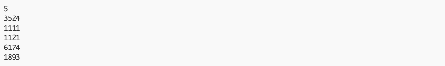
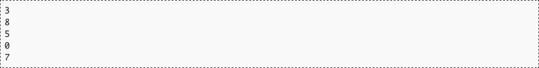

# Constante de Kaprekar

El matemático indio Dattaraya Ramchandra Kaprekar descubrió en 1949 una curiosa característica del número 6174. Hoy, se conoce a dicho número como *constante de Kaprekar* en honor a él.

El número es notable por la siguiente propiedad:

1. Elige un número de cuatro dígitos que tenga al menos dos diferentes (es válido colocar el dígito 0 al principio, por lo que el número 0009 es válido).
2. Coloca sus dígitos en orden ascendente y en orden descendente para formar dos nuevos números. Puedes añadir los dígitos 0 que necesites al principio.
3. Resta el menor al mayor.
4. Vuelve al paso 2.

A este proceso se le conoce como la *rutina de Kaprekar*, y siempre llegará al número 6174 en, como mucho, 7 iteraciones. Una vez en él, el proceso no avanzará, dado que 7641 − 1467 = 6174.

Por ejemplo, el número 3524 alcanzará la constante de Kaprekar en 3 iteraciones:

Los únicos dígitos de cuatro cifras para los que la rutina de Kaprekar no alcanza el número 6174 son los *repdigits*, es decir aquellos cuyas cuatro cifras son iguales (como 1111), pues en la primera iteración se alcanzará el valor 0 y no podrá salirse de él. Es por esto que en el paso 1 se pedía explícitamente que el número inicial tuviera al menos dos dígitos diferentes.

El resto de los números de cuatro cifras terminarán siempre en el número 6174.

A continuación se muestran dos ejemplos más:

* El número 1121 necesita 5 iteraciones:

* El número 1893 necesita 7:

## Entrada

La primera línea de la entrada contendrá el número de casos de prueba. Cada uno contendrá, en una única línea, un número a comprobar.

## Salida

Para cada caso de prueba, el programa indicará el número de vueltas que se debe dar a la rutina de Kaprekar para alcanzar el `6174`. Para los números *repdigits* deberá escribir 8. Para la propia constante de Kaprekar deberá indicar 0.

## Entrada de ejemplo

## Salida de ejemplo

## Lenguaje empleado

	

---

[🛜 Aquí puedes encontrar el sitio web oficial donde se encuentra este reto.](https://aceptaelreto.com/pub/problems/v001/00/st/statements/Spanish/index.html)